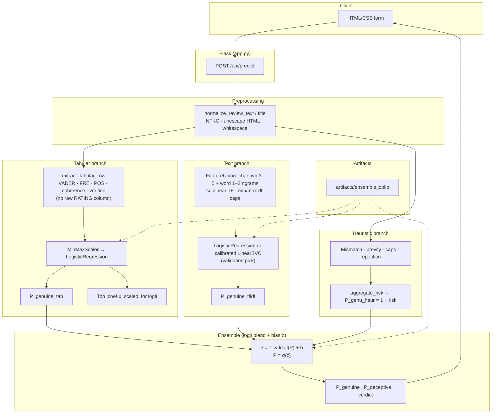

# Pipeline architecture diagram

This file contains a single **Mermaid** diagram of the fake-review scoring stack: from HTTP input through preprocessing, parallel feature branches, ensemble fusion, and JSON/UI output.

### Reading the diagram

- **Solid arrows** are runtime data flow on each prediction.
- **Dotted arrows** show that fitted parameters (vectorizer vocabulary, scaler bounds, logistic weights, ensemble weights) are loaded from `ensemble.joblib` produced by `scripts/train_pipeline.py`.
- **Text branch** matches `tfidf_pipeline.py`: character n-grams (width 3–5, word-boundary aware) *and* word unigrams/bigrams in one `FeatureUnion`; training picks either a logistic head or a calibrated linear SVM by validation macro-F1.
